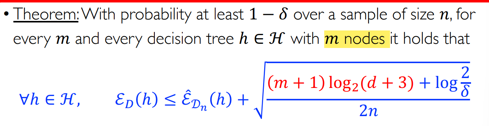

介绍随机森林算法和boost的基本概念。
<!--more-->
***This note is compiled based on the course materials provided by Professor Mingsheng Long in course "machine learning" at tsinghua university.*** 
***终于按时写了一次***🥳
# lecture 10

## Generalization Bound of decision tree

VC-dimension is too loose for decision tree. So we use minimum description length bound here.

## summary: decision tree

advantages: 

- inexpensive to construct and fast at classifying new samples
- easy to interpret

and make no use of geometry (never use “distance” in decision tree, which is an important definition in geometry). Unlike SVM or KNN, this is a nonmetric method, feature scale irrelevant.

- cope with categorical and continuous variables
- cope with missing values and noisy data
- prediction functions are not continuous, this is preferred in classification, but undesirable for regression

# random forest

Random forest originates from a naive idea: we can get different trees using different samples and different features, then use majority vote for inference.

## Bagging

### Boostrap

Bootstrap: randomly draw datasets **with replacements**

- some samples will show up multiple times
- some will not show up at all (about 63.2% will show up at least once)

$$
\textbf{the probability of never showing up: }(1-\frac{1}{n})^n\sim \frac{1}{e}
$$

### Bootstrap Method

$\textbf{original dataset: }\mathcal{D}_n; \textbf{ samples: } \mathcal{D}_n^1,\mathcal{D}_n^2,...,\mathcal{D}_n^{B}$

We can compute a statistic value for each sample:

$$
\phi(\mathcal{D}_n^1),\phi(\mathcal{D}_n^2),...,\phi(\mathcal{D}_n^B)
$$

- as though $\mathcal{D}_n^1,\mathcal{D}_n^2,...,\mathcal{D}_n^B$ are i.i.d  from P
- Things $\mathcal{D}_n^1,\mathcal{D}_n^2,...,\mathcal{D}_n^B$ often come out very close to what we will obtain with independent samples from B.

### Bootstrap Aggregation (Bagging)

1. do Bootstrap method 
2. let $\phi$ be the prediction function for each sample
3. the bagged prediction function is a combination of these functions

$$
h_{bag}(x)=\textbf{Combine}(h_{D_n^1}(x),h_{D_n^2}(x),...,h_{D_n^B}(x))
$$

### OOB: Out-of-Bag Validation

The remaining samples that are not sampled in bag are called OOB observations, which are used as validation set.

## Breiman Algorithm

For each tree, besides randomly sampling, we choose different $K$ features to add some randomness.

The results of using random forest (feature randomly choosing + bagging) or only bagging are below.

1. random forest is better than bagging on test set, meaning randomly choosing features decreases the variance.
2. OOB on bagging is better. Meta overfitting appeared, which means we overfit the validation set.

All in all, the result of each tree in the forest, or the result after every choosing for the random forest may not be good enough, but the final result on testing set will show the privilege of random forest.

### why ensemble makes better ?

First, different sampling on samples and choosing on features lead to variable trees, which helps decrease the variance.

Second, the tree model suffers from high variance, for trees differ a lot.

So bagging helps, ensemble helps!

# Ensemble

Based on the current learning theory, a complex model has large generalization error. If we combine different models, we may approach the true labeling function ?

## Why ensemble

$T$ binary classifiers $\{h_t(x)\}_{t=1}^T$ in parallel, combine by voting ( if more than half of $h_t$ output 1, $H$ will output 1, otherwise -1 )

$$
H(x)=sign(\sum_{i=1}^Th_t(x))
$$

expected error: $\epsilon$, $P(h_t(x)\neq y)=\epsilon$

We want to control the error of $H(x)$

$$
P(H(x)\neq y)=P(\sum_{t=1}^T1[h_t(x)\neq y]\geq \frac{1}{2}\times T)
$$

Assume the events are independent with each other

$$
P(\sum_{t=1}^T1[h_t(x)\neq y]\geq \frac{1}{2}\times T)
$$

$$
= P(\sum_{t=1}^T1[h_t(x)\neq y]-T\epsilon\geq \frac{1}{2}\times T-T\epsilon)
$$

$$
= P(\sum_{t=1}^T1[h_t(x)\neq y]-T\times E\{1[h_t(x)\neq y]\} \geq \frac{1}{2}\times T-T\times  E\{1[h_t(x)\neq y]\})
$$

$$
\leq  P(|\sum_{t=1}^T1[h_t(x)\neq y]-T\times E\{1[h_t(x)\neq y]\} |\geq \frac{1}{2}\times T-T\times  E\{1[h_t(x)\neq y]\})
$$

Then use Hoeffding’s inequality:

$$
\leq 2exp(-\frac{1}{2}T(1-2\epsilon )^2)
$$

It seems we have got a very good result: larger T , tighter bound, meaning better generalization strength.

But here we have a strong assumption:

$**\{h_t(x)\}_{t=1}^T$ is independent**

This is not true in reality……

 **Thinking about this bias, how to enhance diversity, coming near to independent?**

- Bootstrap: different draws from training data.
- Boosting: different weights over training data.
- Random subspace: similar to Random Forest

## Parallel Ensemble vs. Sequential Ensemble

- Parallel Ensemble
    - each model is built independently
    - bagging and random forest
    - Idea hidden: combine **different strong models** to avoid **overfitting**
- Sequential Ensemble
    - models are built sequentially
    - boosting and XGBoost
    - idea: combine **different weak models** to avoid **underfitting**

# Boosting

First, we define a weak learner:

$$
p_{D_n\sim D^n}[\epsilon(h_{D_n}\leq \frac{1}{2}-\gamma)]\geq 1-\delta
$$

($\frac{1}{2}$ here means the worst prediction, learning nothing)

For example, we only learn a decision stump each time:

We want to boost many weak classifiers to create a strong learner. So the problem comes to how we combine those weak learners.

We use a scoring function : $f_t(x)=\sum_{s=1}^t\alpha_sh_s(x)$, and final binary classifier is $h(x)=sign(f_t(x))$

 

So how we get each $h_i$? By sequential learning !

$$
(\alpha_t,h_t)=argmin_{\alpha_t,h_t}\frac{1}{n}\sum_{i=1}^nl(y_i,f_{t-1}(x_i)+\alpha_th_t(x_i))
$$

## Adaptive boosting (AdaBoost)

$$
(\alpha_t,h_t)=argmin_{\alpha_t,h_t}\frac{1}{n}\sum_{i=1}^nl(y_i,f_{t-1}(x_i)+\alpha_th_t(x_i))
$$

We need to optimize the equation above. For a single model at a time.

loss function: exponential loss

$$
l(y,f(x))=exp(-yf(x))
$$

Then we can get the whole AdaBoost algorithm

$D$ here is the weight for each model (from 1 to T).