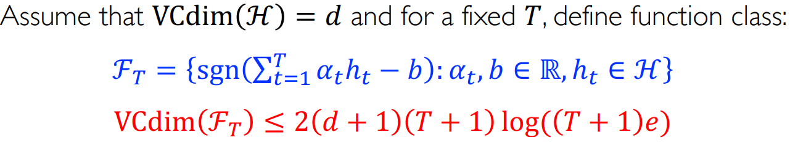

介绍AdaBoost以及有关其训练误差/泛化误差相关说明，介绍Gradient Boost。
<!--more-->
***This note is compiled based on the course materials provided by Professor Mingsheng Long in course "machine learning" at tsinghua university.*** 
***boosting is magical, additive model is magical***
# lecture 11

# Adaptive Boosting

## AdaBoost’s theoretical proof

In the last lecture, we get to know AdaBoost. But thinking best to the initial optimization problem:

$$
(\alpha_t,h_t)=argmin_{\alpha_t,h_t}\frac{1}{n}\sum_{i=1}^n\mathcal{l}(y_i,f_{t-1}(x_i)+\alpha_th_t(x_i))
$$

This might be different from AdaBoost. In AdaBoost, we observed:

$$
D_{t+1}(i)=\frac{D_{t}(i)e^{-\alpha_ty_ih_t(x_i)}}{Z_t}=...=\frac{e^{-y_i\sum_{s=1}^t\alpha_sh_s(x_i)}}{\prod_{s=1}^tZ_s}
$$

The current weight for sample i is determined by the past $t$ classifier and the weight for each classifier.  So we can write the objective function of Boosting with exponential loss:

$$
F(\hat{\alpha})=\frac{1}{n}\sum_{i=1}^ne^{-y_i\sum_{j=1}^N\hat{\alpha}_jh_j(x_i)}
$$

The exponential item means models are additive and finally get a scoring function. $\alpha$ is a n dim vector, which decides which model is chosen. **The AdaBoost algorithm is equivalent to the optimization of $F(\hat{\alpha})$ using Coordinate Descent (CD)**, which iterates between $\{h_t(x)\}$ and $\{\alpha_t\}$  . **Proof as follows:**

As we know, in AdaBoost, we change the weight of each sample in iteration. So define the distribution at iteration t:

$$ \hat{D}_t(i)=\frac{e^{-y_i\sum_{j=1}^N\hat{\alpha}_{t-1,j}h_j(x_i)}}{\hat{Z_t}} $$

In iteration t-1, we have  $F(\hat{\alpha}_{t-1}+\eta e_k)=\frac{1}{n}\sum_{i=1}^ne^{-y_i\sum_{j=1}^N\hat{\alpha}_{j,t-1}h_j(x_i)-y_i\eta h_{k}(x_i)}$. For each unit vector $e_k$ with best directional derivative:

$$ F^{'}(\hat{\alpha}_{t-1},e_k)=lim_{\eta\rightarrow 0}\frac{F(\hat{\alpha }_{t-1}+\eta e_k)-F(\hat{\alpha}_{t-1})}{\eta} $$

$$ =-\frac{1}{n}\sum_{i=1}^ny_ih_k(x_i)e^{-y_i\sum_{j=1}^N\hat{\alpha}_{j,t-1}h_j(x_i)} $$

$$ =-\frac{1}{n}y_ih_k(x_i)\sum_{i=1}^ne^{-y_i\sum_{j=1}^N\hat{\alpha}_{j,t-1}h_j(x_i)} $$

$$ =-\frac{1}{n}\sum_{i=1}^ny_ih_k(x_i)\hat{D}_t(i)\hat{Z}_t $$

$$ =-\frac{\hat{Z}_t}{n}[\sum_{i=1}^n\hat{D}_t(i)\mathcal{1}[y_ih_k(x_i)=1]-{D}_t(i)\mathcal{1}[y_ih_k(x_i)=-1]]  $$

$$ =-\frac{\hat{Z}_t}{n}[(1-\hat{\epsilon}_{t,k})-\hat{\epsilon_{t,k}}]=\frac{\hat{Z}_t}{n}[2\hat{\epsilon}_{t,k}-1] $$

This is directional derivative in unit vector $e_k$. So minimizing $\hat{\epsilon}_{t,k}$ (in distribution $D_t$) is maximizing the descent along $e_k$ direction.( all empirical error is less than 0.5 )

We want to get the maximum of $\eta$ , so let the gradient of $\eta$  (not the same with above directional derivative)equals 0 :

$$\frac{\partial F(\hat\alpha_{t-1}+\eta e_k)}{\partial \eta}=0$$

$$\frac{1}{n}\sum_{i=1}^n\hat{D}_t(x_i)y_ih_k(x_i)e^{-y_i\eta h_{k}(x_i)}=0$$

$$\sum_{i=1}^n\hat{D}_t(i)\mathcal{1}[y_ih_k(x_i)=1]e^{-\eta}-{D}_t(i)\mathcal{1}[y_ih_k(x_i)=-1]e^{\eta}$$
$$=(1-\hat{\epsilon}_{t,k})e^{-\eta}-\hat{\epsilon}_{t,k}e^{\eta}=0$$

$$\eta = \frac{1}{2}log\frac{1-\hat{\epsilon}_{t,k}}{\hat{\epsilon}_{t,k}}$$

## Practical Guide

- the base learners are decision trees, often just decision stumps in boosting, which are simple and weak learners
- boosting stumps(data in $\mathcal{R}^d$, T stumps)
    - pre-sort each feature $O(dn\;log\;n)$
    - total complexity $O(dnlogn +ndT)$

strengths:

- simple: straightforward
- efficient: low complexity
- theoretical guarantees

outliers:

- assign larger weights to harder examples
- detect mislabeled examples and deal with noisy data

weakness:

- determining T (the number of stumps) is not trivial
- need to determine the base learners: risk of overfitting or low margin(will be explained latter)

## Ada Boost’s Empirical Error Bound

 

$$
\hat{\epsilon}(h)= \frac{1}{n}\sum_{i=1}^n1[y_if(x_i)\leq 0]\leq \frac{1}{n}\sum_{i=1}^ne^{-y_if(x_i)}
$$

From the initial proof about AdaBoost in this lecture 

$$
D_{t+1}(i)=\frac{D_{t}(i)e^{-\alpha_ty_ih_t(x_i)}}{Z_t}=...=\frac{1}{n}\frac{e^{-y_i\sum_{s=1}^t\alpha_sh_s(x_i)}}{\prod_{s=1}^tZ_s}=\frac{1}{n}\frac{e^{-y_if_t(x_i)}}{\prod_{s=1}^tZ_s}
$$

So we get

$$
\hat{\epsilon}(h)\leq \frac{1}{n}\sum_{i=1}^n(nD_{T+1}(i)\prod_{s=1}^TZ_s)=\prod_{s=1}^TZ_s
$$

Recall that $Z_s$ is a normalization factor:

$$
Z_t=\sum_{i=1}^nD_t(i)e^{-\alpha_ty_ih_t(x_i)}
$$

$$
=(1-\epsilon_t)e^{-\alpha_t}+\epsilon_te^{\alpha_t}
$$

We want to minimize $Z_t$, so let the gradient of $\alpha_t$ equals 0:

$$
\alpha_t = \frac{1}{2}log\frac{1-\epsilon_t}{\epsilon_t}
$$

And:

$$
Z_t= 2\sqrt{\epsilon_t(1-\epsilon_t)}
$$

So the upper bound of empirical error is

$$
\hat{\epsilon}(h)\leq \prod_{s=1}^tZ_s=\prod_{s=1}^t\sqrt{1-4(\frac{1}{2}-\epsilon_s)^2}\leq \prod_{s=1}^t e^{-2(\frac{1}{2}-\epsilon_s)^2}=e^{-2\sum_{s=1}^T(\frac{1}{2}-\epsilon_s)^2}
$$

That is say: by increasing T, the empirical error’s upper bound will decrease (to zero). Good property , meaning AdaBoost has a large model capacity.

## Ada Boost’s Generalization Bound

Here the proof is not complete, just show some understanding and insights.

Bad news from VC dimension: when increasing T, the upper bound get looser. So we imply : AdaBoost overfits for large values of T.

Unexpectedly, overfit does not happen. Why?  We use **margin theory** to add patch for current theory.

When a model has a low(nearly 0) empirical error, the hypothesis space should be large enough. So that the $\mathcal{R}_n(\mathcal{H})$ will be large, meaning less generalization. Luckily, we have a $\rho$ for the bound.

 AdaBoost has a not too small $\rho$. It  can achieve asymptotically a margin $\frac{\rho_{max}}{2}$.

# Gradient Boosting

AdaBoost is elegant. But it only tackle binary classification with exponential loss (this implies less robustness or more sensitive to noisy data). So we want some general algorithm supporting more loss functions.

We have the same objective function:

$$
(\alpha_t,h_t)=argmin_{\alpha_t,h_t}\frac{1}{n}\sum_{i=1}^n\mathcal{l}(y_i,f_{t-1}(x_i)+\alpha_th_t(x_i))
$$

an increment for iteration  : $u_t=(\alpha_th_t(x_1),\alpha_th_t(x_2),...,\alpha_th_t(x_n))$ 

previous output: $v_t=(f_{t-1}(x_1),f_{t-1}(x_2),...,f_{t-1}(x_n))$

So the objective becomes:

$$
F(u_t,v_t) =\sum_{i=1}^nl(y_i,u_{ti}+v_{ti})
$$

We want to choose a good $u_t$ to minimize the objective function. 

Consider: If we only has $v_t$ in this function, we will minimize the function by finding the gradient of $v_t$, and let $v_t$ decrease in the gradient direction with a learning rate $\eta$ .As:

So applying this equation into $u_t,v_t$:

We only find the gradient of $v_{ti}$. So the loss function should be sub-differentiable, not required for  $h$. And here, we can do regression on base hypothesis $h_t(x)$(e.g. regression tree)

In a word, AdaBoost uses exponential loss function and add weight for different samples. The choice of loss function is limited and the weight added will shrink the number of effective samples. (Data is expensive and data matters. The shrink causes damage for sufficient usage of samples. That is also why we do not do any additional operation for samples in deep learning)

## Gradient Boosting Machine(GBM)

Suppose we use the squared loss and compute the gradient:

Example:

Suppose we use logistic loss:

$$
l(y,f(x))=log(1+e^{-yf(x)})
$$

Example:

This task might be not easy for linear classifier, for the distribution is complex.