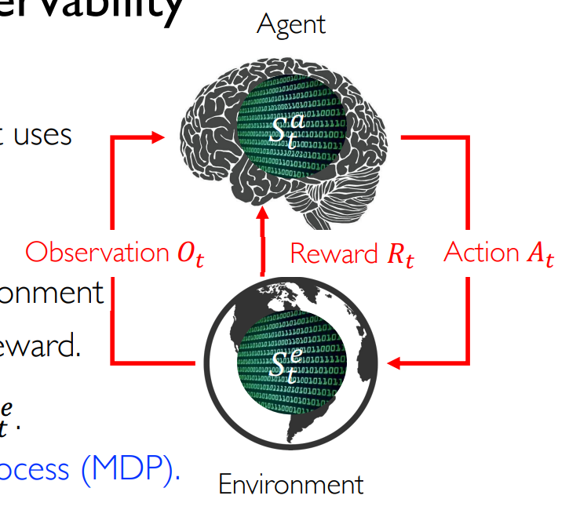

介绍reinforcement learning的基础概念(agent, environment, state, reward)以及相关数学背景。
<!--more-->
***This note is compiled based on the course materials provided by Professor Mingsheng Long in course "machine learning" at tsinghua university.*** 
>An initially naive agent, with a restricted observational perspective and a finite set of action steps, has the potential to evolve into a formidable entity. She undergoes this transformation by continually learning and adapting to her surroundings and rewards. Her focus lies more on long-term rewards rather than short-sighted evaluations.🥺
# lecture 12

# Intro to reinforcement learning

Reinforcement learning covers series of subjects. It is one machine learning method and also studied in neuroscience(reward model especially). 

- sequential decision making | time really matters
- no supervisor(In supervised learning, there are data and labels): only a reward signal;

Also:

- Feedback is delayed, not always instantaneous(some instantaneous, like Atari game,  are easier to be solved)
- The agent’s actions affect the data

## basic concepts

### state

There are two models in reinforcement learning:

- agent
    - receive observation $O_t$
    - receive scalar reward $R_t$
    - executes action $A_t$
- environment
    - receives action $A_t$
    - emits observation $O_{t+1}$
    - emits scalar reward $R_{t+1}$

The history here is a three-tuple:

$$
H_t=O_1,R_1,A_1,...,O_t,R_t
$$

some problem have an end, up to time t, some are infinite.

And the history matters: what happens depends on the history, the agent selects actions and the environment select observations and rewards. 

$\textbf{State} \; S$  is the information used to determine what happens next. That is say:

$$
S_t=f(H_t)
$$

Here f means extracting features from history, and can be a deep learning model.

### reward

Reward is a scalar feedback signal, it is set on some states. Rewards plays significant role in rl, for it decides  what is important and what is not, leading to different policy learnt.

Reward indicates how well agent is doing at step t. The agent’s job is to maximized cumulative reward(not just for next step). Reinforcement learning always sacrifice immediate reward to gain long-term reward.

**Reward Hypothesis** 

- All goals can be described by the maximization of the expected cumulative reward.
- What might be wrong here? **All bet on the goodness of reward.**

### observability

- Agent state $S_t^a$ : whatever information agent uses to pick the next action
- Environment state $S_t^e$: whatever information environment uses for next observation, reward

Compared with $O_t$, we can define 

1. Full observability: $O_t=S_t^a=S_t^e$ → **MDP(Markov decision process)**
2. partial observability: $S_t^a\neq S_t^e$ → **POMOP(partially observable Markov decision process)** e.g. in autonomous driving technique, both camera and lidar installed can not observe the full environment

## Components of RL

## some examples

### maze game

**Model is always imperfect**, for sometimes the feature has high-dimension or hard to capture and learn.

### Atari Game

This reward is instantaneous, make it much easier.

### Board game

This reward is always on the way ☹️

### Robot Locomotion

The state here is hard to get : through using computer vision technique, we can derive some information form the image, or directly use some representations like angle and position of joints.

## Learning and planning

Reinforcement learning:

- the environment is initially unknown
- learn from interactions with the environment

Planning:

- the environment is known
- the agent just compute

Planning looks more like a pure mathematical problem, not holding a ‘growth’ process.

# Mathematical Framework

## Markov Reward Process

### Markov Process (MP)

$$
\mathcal{P}(S_{t+1}|S_t)=\mathcal{P}(S_{t+1}|S_1,S_2,...,S_t)
$$

Next state only depends on the past one state. State here captures all relevant information of the history.

State transition probability

$$
\mathcal{P}_{s^{'}s}=\mathbf{P}[S_{t+1}=s^{'}|S_t=s]
$$

### Markov Reward Process (MRP)

add reward to MP

Note that here the reward is a random variable, depending on the state transition probability matrix.  And each state is given an immediate reward if transited to next stage. The reward for each state implies the goodness or potential of a state.

**Return**

- $\gamma\in [0,1]$ quantifies present value of future rewards, and guarantee the convergence
    - close to 0 leads to myopic evaluation
    - close to 1 leads to far-sighted evaluation
- If the trajectory or episode is fixed, the return can be computed as a definite value. But according to the definition, both $G_t$ and $R_t$ are  random variables.

Though $G_t$  is derived from $R_t$, $R_t$  is not enough as a direct way to describe the future return. We  focus on value function, which gives the **long-term** value of each state

$$
v(s)=\mathbf{E}[G_t|S_t=s]
$$

### Bellman equation

***important in rl***

$$
v(s)=\mathbf{E}[G_t|S_t=s]
$$

$$
=\mathbf{E}[R_{t+1}+\gamma R_{t+2}+\gamma^2R_{t+3}+...|S_t=s]
$$

$$
=\mathbf{E}[R_{t+1}+\gamma (R_{t+2}+\gamma R_{t+3}...)|S_t=s]
$$

$$
=\mathbf{E}[R_{t+1}+\gamma G_{t+1}|S_t=s]=\mathbf{E}[R_{t+1}+\gamma v(S_{t+1})|S_t=s]
$$

Like dynamic programming, this problem had a optimal sub-structure(due to the markov property).

$v(s) =\mathbf{E}[R_{t+1}|S_t=s]+\mathbf{E}[\gamma v(S_{t+1})|S_t=s)]$

- denote $\mathbf{E}[R_{t+1}|S_t=s]=\mathcal{R}_s$
- $\mathbf{E}[\gamma v(S_{t+1})|S_t=s]=\sum\{\gamma v(s^{'})P(S_{t+1}=s^{'}|S_t=s)\}$

$$
v(s)=\mathcal{R}_s+\gamma  \sum\{v(s^{'})P_{s^{'},s}\}
$$

A matrix form:

## Markov Decision Process (MDP)

add decision 

### policy

what action we choose to do at a state is defined as policy

$$
\pi(a|s)=\mathbf{P}[A_t=a|S_t=s]
$$

- a policy fully defines the behavior. but we do not focus on the deciding problem, just give a policy with probability
- policy only depends on the current state
- policy is stationary, and time-independent

### value function

state-value function is the expected return starting from the state s and then following policy. 

$$
v_{\pi}(s)=\mathbf{E}_{\pi}[G_t|S_t=s]
$$

action-value function is the expected return starting from state s, taking action a and then following policy(indicating actions after $A_t$ shall follow policy $\pi$)

$$
q_{\pi}(s,a)=\mathbf{E}_{\pi}[G_t|S_t=s,A_t=a]
$$

### bellman equation

$$
v_{\pi}(s)=\mathbf{E}_{\pi}[R_{t+1}+\gamma v(S_{t+1})|S_t=s]
$$

$$
=\sum_{a\in \mathcal{A}}\pi(a|s)(R_s^a+\gamma \sum_{s\in \mathcal{S}}P_{ss^{'}}^av_\pi(s^{'}))
$$

$$
q_{\pi}(s,a)=\mathbf{E}[R_{t+1}+\gamma q_{\pi}(S_{t+1},A_{t+1})|S_t=s,A_t=a]
$$

$$
=R_s^a+\gamma \sum_{s\in \mathcal{S}}P_{ss^{'}}^a\sum_{a\in \mathcal{A}}\pi(a|s)q_{\pi}(s^{'},a)
$$

