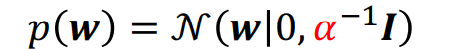

从MLE到MAP，从回归到分类，包含了部分数学证明。
<!--more-->
***This note is compiled based on the course materials provided by Professor Mingsheng Long in course "machine learning" at tsinghua university.*** 

# lecture 3

## MAP: maximum a posteriori estimator

In the lecture 2, we know how we can get the maximum likelihood estimation. Due to Bayes Rule:

$$
P(\theta|D)=\frac{p(D|\theta)P(\theta)}{P(D)}
$$

$P(\theta|D)$ is the posterior p, $p(D|\theta)$ is likelihood , $P(\theta)$ is the prior . That is to say : before we get data , we have a  $P(\theta)$, after we get data, we have a   $P(\theta|D)$

***notice: here we take no care about the data distribution***

So by adding a prior estimation of the parameters , we can do maximum a posteriori estimator (MAP). 

$$
\hat{\theta}=argmax_\theta \{logP(D|\theta)+logP(\theta)\}
$$

*MLE is MAP variant with a uniform prior. MLE just find one set of parameters, but the model can be a probability distribution.(I **think it is the biggest difference between MLE and MAP)***

As the mount of data becomes large, 

- posterior variance becomes small
- MAP behaves like other estimators

That reveals: more data leads to less importance of prior knowledge. In reverse , more importance. 

## Regularized Linear Regression

For ordinary linear regression, we have a guassian noise assumption.

 We have a very common choice of the prior for w:

- No features should be dominant
- Each feature tends to be useless shows up(as the figure shows below 😻)

MAP estimation :

$$
\hat{w}=argmin_w\{-log(P(y|w,X))-logP(w)\}
$$

$$
-log(P(y|w))=-\sum_{i=1}^{n}log(P(y_i|w,x_i))=-\frac{n}{2}log\frac{1}{2\pi\phi^2}+\frac{1}{2\phi^2}\sum_{i=1}^{n}(y_i-w^Tx_i)^2
$$

$$
-logP(w)=-\frac{d}{2}log\frac{\alpha}{2\pi}+\frac{\alpha}{2}\sum_{j=1}^{d}w_j^2
$$

$$
\hat{w}=argmin_w\frac{1}{2\phi^2}\sum_{i=1}^{n}(y_i-w^Tx_i)^2+\frac{\alpha}{2}\sum_{j=1}^{d}w_j^2
$$

从这个角度来说，不同的对于参数的假设会导致loss function中不同的除去二次误差的另一项，其实也就是不同的正则项。我们加的先验假设中是倾向于更简单的模型 ，倾向于所有的参数都不重要，这和添加正则项的目的实际上是一致的。

# linear regression

## logistic regression

We now need to solve a classification problem,  but how to design the loss function?

- Discretize the continuous regression result to be {0,1},then minimize the loss
    - bad mathematical property: gradient lost
- Just minimize the loss (set y is 0/1, then do h(x)-y)
    - makes no sense when regression result $h(x)$ becomes far away from 0-1
    - a too loose upper bound

As the figure shows:

Both are bad ideas.

### Logistic Regression: Link Function

Still map h(x) , but not discretize , but map into (0,1). Here we use a sigmoid function.

$$
\sigma(t)=\frac{1}{1+e^{-t}}
$$

Then we set the $\sigma(t)=p(y=1|x)$ (😍 a surprising but useful assumption).

Naturally, we consider keeping using the squared loss. $h(x)\in[0,1],y\in\{0,1\}$

But not work : non-convex and small loss when prediction is overly far in the wrong side.

### statistical view

Thinking back to where we get the squared loss, we use four assumptions in MLE, now we can not do the guassian assumption. So this format of loss not works well.

Based on  assumption:  $\sigma(t)=p(y=1|x)=\frac{1}{1+exp(-w^Tx)}$,  and use MLE 

$$
max \prod_{i=1}^{n}\prod_{c=0}^{1}p(y_i=c|x)^{1\{y_i=c\}}
$$

*the first prod comes from i.i.d. assumption. the whole follows bernoulli distribution.*

into log minimize:

$$
min_w-\frac{1}{n}\sum_{i=1}^{n}\sum_{c=0}^11\{y_i=c\}log\;p(y_i=c|x)
$$

$$
-\frac{1}{n}\sum_{i=1}^{n}\sum_{c=0}^11\{y_i=c\}log\;p(y_i=c|x)\\=-\frac{1}{n}\sum_{i=1}^{n}(y_ilog\;p(y_i=1|x)+(1-y_i)log\;p(y_i=0|x))\\=-\frac{1}{n}\sum_{i=1}^{n}(y_ilog\;\sigma(w^Tx)+(1-y_i)(1-log\;\sigma(w^Tx)))
$$

So the loss function:

Check if y=1,if  $\sigma(w^Tx)=1$ , the loss will be 0 ; else the loss will be infinity, make sense.

Compared to the squared loss, convex and larger punish for wrong.

### regularization

If the dataset is not linearly separable (no hyperplane that separates the two classes)/due to some data noises or some distant point, LR needs regularization.

Add the red component to avoid weight diverging.

## softmax regression

Like logistic regression, we keep on mapping the output of linear regression into probability. There are multiple classes , so we use multiple linear predictors. So **how to change the outputs of multiple predictors into probability?**

### softmax function

same as first grade for every class, then mapping into >0, then normalize 

### statistical view

$$
min_w-\frac{1}{m}\sum_{i=1}^{m}\sum_{c=0}^C1\{y_i=c\}log\;p(y_i=c|x)
$$

$$
min_w-\frac{1}{m}\sum_{i=1}^{m}\sum_{c=0}^C1\{y_i=c\}log\;\frac{exp(w_c^Tx_i+b_c)}{\sum_{r=1}^Cexp(w_r^Tx_i+b_r)}
$$

