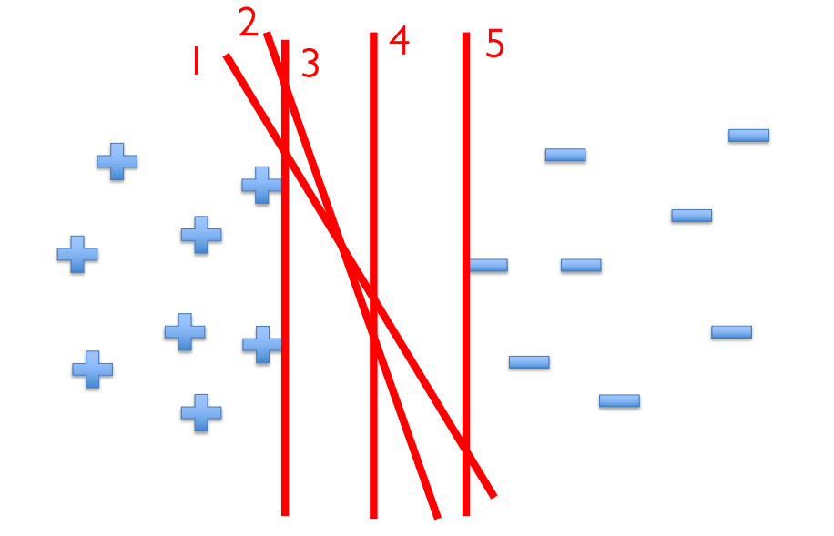

介绍SVM 支持向量机的来历，优化方法，损失函数来历。
<!--more-->
***This note is compiled based on the course materials provided by Professor Mingsheng Long in course "machine learning" at tsinghua university.*** 

# lecture 4

# supporting vector machine

## introduction

Unlike we treat classification problem from a regression solution, here we just want to find a linear classifier to do the classification. From a geometry view, we want to find a hyperplane. 

New convention: 

- explicitly write the intercept b
- change {0,1} to {-1,1}

So under below situation, though all hyperplanes can separate the two classes, which one is the best classifier?

 

two standards :

1. the largest margin to the training data (robust for noisy data)
2. high confidence classification (far is better)

**Margin:** Twice of the distance to the closest points of either class.
-Twice of the largest noise that can be tolerated by the classifier

**So how to find the classifier with the largest margin?**

## margin

two requirements :

- the margin is the largest
- classify all data points correctly

It becomes a constrained optimization problem (find the largest margin and constrained by the right classification):

$$
max_{w,b}\;margin(w,b)
$$

$$
s.t.\;y_i(wx_i+b)\geq 1,\;1\leq i\leq n
$$

Here 1 is the margin here, but can be any positive integer.

> recall: point-hyperplane distance 
point $x_0$, hyperplane with a normal vector $w$ and a interpret b ($wx+b=0$)
> 

$$
distance=\frac{|w(x_0-x)|}{||w||}=\frac{|wx_0+b|}{||w||}
$$

### hard-margin support vector machine

When the points closest to the margin lie on $wx+b=1/-1$, the margin $\gamma$ is  

$$
\gamma=\frac{2}{||w||_2}
$$

same as(the convention due to$||w||_2$ is convex function but $\frac{1}{||w||_2}$ is non-convex ):

**This is only for the linearly separable case.
Hardly used in practice!**

### soft-margin support vector machine

- sometimes under linearly non-separable case , no solution
- small margin may cause overfitting

So we add a slack variables  $\xi$ 

Then the problem becomes:

$$
min_{w,b,\xi}\frac{1}{2}||w||_2^2,\; s.t.\;y_i(wx_i+b)\geq1-\xi_i
$$

$$
\xi_i\geq0,\;\sum_{i=1}^{n}\xi_i\leq n^{'},1\leq i\leq n 
$$

(every x has and is constrained by a slack variable , but the sum of all slack variables cannot be too large)

## Soft-SVM for multiclass classification

The original SVM can only solve two-class classification. If we want to do multi classed classification, can we train a set of classifications , each one classify the i-th class from others and then select the largest value ?

Obviously, comparing their prediction values may not make much sense… This approach is not as elegant as softmax regression for no probability produced.

# optimization

## constrained optimization

Consider a general optimization problem:

$$
min_x\;f(x),\; s.t. \;x\in X
$$

Finding the minimum is an optimization process, and the “belonging to” demonstrates a constraint.

A convex optimization:

 Understanding a convex function is easy: any chord of the function is above the function curve/ any tangent of the function is below the function curve.

### equality constraints

$$
min_x\;f(x),\; s.t. \;g(x)=0
$$

The closure is $g(x)=0$, so the gradient is orthogonal to the tangent of the surface.

And the gradient of f(x) needs to be orthogonal to the tangent. Because the gradient represents the changing direction of the function, the minimum point on the curve can not decrease its value by moving along a small distance along the curve.

That is to say:

$$
\nabla f+\mu \nabla g=0, for \;\mu \neq 0 
$$

Lagrangian function of this problem is defined by:

- a d+1 dimension equation
- Stationary point x gives the f(x) minimum.

### inequality constraints

$$
min_x\;f(x),\; s.t. \;g(x)\leq0
$$

If the point lies on the curve, the same as equality constraint. Else, solve what?

The solution to the constrained optimization problem with inequality constraints is yielded by optimizing the **Lagrangian function.**

$$
L(x,\lambda)=f(x)+\lambda g(x)
$$

**Karush-Kuhn-Tucker (KKT) conditions :**

### general lagrangian function

**function:**

$$
L(x,\lambda, \mu)=f(x)+\sum_{j=1}^{J}\lambda_jg_j(x)+\sum_{k=1}^{K}\mu_kh_k(x)
$$

**KKT conditions:**

$$
primal \;feasibility:\;g_j(x)\leq 0 , h_k(x)=0
$$

$$
dual\;feasibility:\;\lambda_j\geq 0
$$

$$
complementary\;slackness:\;\lambda_jg_j(x)=0
$$

And:

Optimal ?

One optimal $x$, one $\lambda, \mu$ corresponding.

## dual problem: lagrangian method

The primal problem: 

converting into dual problem :

整个拉格朗日函数对x求导的过程，实际上是求L函数对于x的最小值。相对应此求得的最小值，会有对应的$\lambda,\mu$。对于x的约束较为复杂，我们更希望关注$\lambda,\mu$。

固定变量x，对于$\lambda,\mu$求L函数的最大值，实际上是此问题的对偶问题。

背后的原理是：

对一个多变量函数，先求（关于某些参数的）最小再求（关于其他参数的）最大，和先求最大再求最小比起来，前者小于等于后者。

---

Back to the Soft-SVM problem, 

Here we add $\xi$ constraint into the L function. The lagrangian function as follows: 

$w,b,\xi_i$ are variables (like x). 

Substituting and do the dual problem:

Then the KKT conditions:

Why called **Supporting vectors ?** 

When $\alpha$ is 0, the point plays no effect. So the vectors playing a role are called supporting vector. 

Thinking back to regularization, we want to get sparse parameters, meaning giving up some less important features.

> I don’t like constrained optimization. I don’t like one-off method.
Give me my SGD back!
> 

## primal problem : SGD

The former soft-SVM can be written into 

Same like the following format, which can be directly solved from importing something…

In another way :

The theorem can be  naturally proved. A lot of unnecessary trails….😵

So what is the loss function? - Hinge Loss function!

(从这里可以得知，在监督学习中，对于损失函数的选择实际上是要和objective function相统一，才能施加合理的惩罚；不至于导致某些data在损失函数中起到不必要的影响/影响过大。或者说可以看作选择某种向量范数的问题，合适的向量范数要求能够在当下的问题场景中恰当的衡量两个向量之间的距离。虽然有限维线性空间中所有的向量范数是等价的，但这仅仅是从大小的角度，并不足以衡量完整的范数信息)

Then just do SGD:

