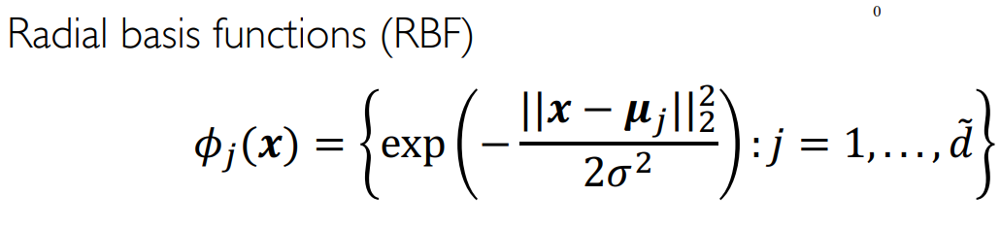

介绍核函数，RBF核函数，以及表示定理。
<!--more-->
***This note is compiled based on the course materials provided by Professor Mingsheng Long in course "machine learning" at tsinghua university.*** 

# lecture 5

# kernel method

## intro

Many problems need non-linear solutions, so we need some basis functions to do nonlinear function(which was mentioned in lecture 1). 

here is RBF: one kind of basis functions

After choosing some basis function, we have determined the hypothesis space. This process of choosing basis functions is called feature engineering.

 But some **limitations** is that though better expressiveness after using basis function, the process of determining which basis function to use is a costly process. 

**So how to solve the dimension-explosion problem?**

## kernel function

Using basis function is mapping input space into a higher-dim space. Then we use a kernel function: inner product of basis function

$$
k(x_1,x_2)=\Phi(x_1)\Phi (x_2) 
$$

An example:

### RBF kernel

By designing a good kernel function, we can avoid being trapped in the infinite feature space, but still have the same strong expressiveness. A good kernel function:

$$
k(x_1,x_2)=exp(-\frac{||x_1-x_2||^2}{2\sigma^2})
$$

- math foundation:
    
     it can be divided into a list (from 0 to $\infty$)of polynomial basis function. Here for simplification, we set $\sigma = \sqrt2$
    
    $$
    k(x_1,x_2)=exp(x_1^{T}x_2-x_1^2-x_2^2)\\=e^{-x_1^2}e^{-x_2^2}e^{x_1^Tx_2}\\=e^{-x_1^2}e^{-x_2^2}(\sum_{j=0}^{\infty}\frac{(x_1^{T}x_2)^j}{j!}\\=e^{-x_1^2}e^{-x_2^2}(\sum_{j=0}^{\infty}\frac{1}{j!}(\sum_{n_1+...+n_d=j}(\frac{x_{11}^{n_1}x_{12}^{n_2}...x_{1d}^{n_d}}{\sqrt{n_1!n_2!...n_d!}})(\frac{x_{21}^{n_1}x_{22}^{n_2}...x_{2d}^{n_d}}{\sqrt{n_1!n_2!...n_d!}})))
    $$
    
    not in extension form:
    
    
    
    So for each j, we can get j polynomial component.
    
    
    
    
    
    so we can get the basis function.
    
- $\sigma$: the bandwidth parameter
    - median trick : $\sigma = median(\{||x_i-x_j||_2,i,j=1,...,n\})$ ; a statistical value
- a special case: choose $\mu_i=x_i$

### other kernel functions

There are other kernel functions.

We can construct new kernel functions. 

**feature cross:**

$$
k^{'}(x_1,x_2)=k_1(x_1,x_2)k_2(x_1,x_2)
$$

g is any function:

$$
k^{'}(x_1,x_2)=g(x_1)k_1(x_1,x_2)g(x_2),\;g:X\rightarrow R
$$

### kernel functions on structured data

graphs, strings, time series, images……

$$
\textbf{graph kernel:}k(x_1,x_2)=exp(-\frac{d(x_1,x_2)^2}{2\sigma^2})
$$

$$
\textbf{string kernel:}k(x_1,x_2)=\sum_{s\in A^{*}}w_s\phi_s(x_1)\phi_s(x_2)\\\phi_s(x)\text{: The number of times that substring s appears in string x.}

$$

### kernel matrix

**Theorem:**

For input $(x_1,x_2,...,x_m)$

This matrix is semi-definite 

**Another expression:**

k is a symmetric function on space X*X

So though we can add some different kernel functions together (like concat the features), but should follow the above theorem.

从基函数到核函数，实际上都是为了引入非线性的成分，对于现实中的问题有更好的表达能力。核函数看似是求内积，但是是把非线性引入带来的巨大的空间维度控制在了内积空间之内，内积衡量的是样本之间的相似度。

## kernel SVM

Before the $k(x_i,x_j)$ is $(x_i,x_j)$,here we simply introduce kernel function to replace the inner dot, then lead in non-linear component.

In inference, we donot need to calculate the w, but only calculate the kernel function of the certain sample and all data.

### kernel SVM  v.s. weighted KNN

(In inference) 

kernel SVM

$$
\sum_{i=1}^{n}a_iy_ik(x_i,x)+b\\=\sum_{i=1}^{n}a_iy_iexp\frac{-||x_i-x||^2}{2\sigma^2}+b
$$

weighted KNN

$$
\hat{y}=\sum_{x_i\in KNN(x)}\frac{1}{D(x,x_i)^2}y_i
$$

事实上，kernel SVM中的a是参数化部分，exp是非参数化部分；和完全非参数化方法KNN比起来，kernel SVM是半参数化方法，学习了加给每个样本的权重。如果把kernel SVM中的a给个阈值，exp超过某个某个阈值置为1，否则置为0，这就退化成了KNN形式；对于KNN来说，kernel SVM也是一种soft形式，用对样本的加权不用在推理阶段去计算和所有的样本距离并排序并取top-k。

但是，也有非参数化模型中相似的问题。非参数化模型对于数据数量的要求更高，换句话说，非参数化模型能学到的东西总是在数据的scope中，很难学到什么新东西。

Below : radial kernel v.s. polynomial 

radial局部性质更好，不会像多项式在有些地方直接发散掉，导致过拟合的问题。

# representer theorem

$$
J(w)=L(w\Phi(x_1),...,...w\Phi(x_n))+R(||w||)\\\text{L is an arbitrary function}\\\Phi\text{ is a feature map from }X\text{ to }H\\|| ||\text{is a norm in }H\\R\text{ is a non-decreasing function}
$$

我们希望找到参数w，使得整体的抽象函数最小化。

参数w可以表示为

$$
w^*=\sum_{i=1}^{n}a_i\Phi(x_i)
$$

(具体证明略去，但是可以知道w是该Hilbert空间中的元素)

所以Kernelization后的写法是(显然的 这里的范数用的是二范数)

$$
min_{a\in R^{n}}L(\sum_{i=1}^na_ik(x_i,x_1),...,\sum_{i=1}^na_ik(x_i,x_n))+R(\sqrt{\sum_{i=1}^n\sum_{j=1}^na_ia_Jk(x_i,x_j)})
$$

## for soft-SVM

soft-SVM的原问题：

可以转为带核函数的优化问题

就可以把一个带约束的优化问题转换成可用SGD求解的问题了

# knowledge graph

bayesian基本只在需要不确定性的情况下使用，用的不多。区别也只杂鱼加了一个先验知识。