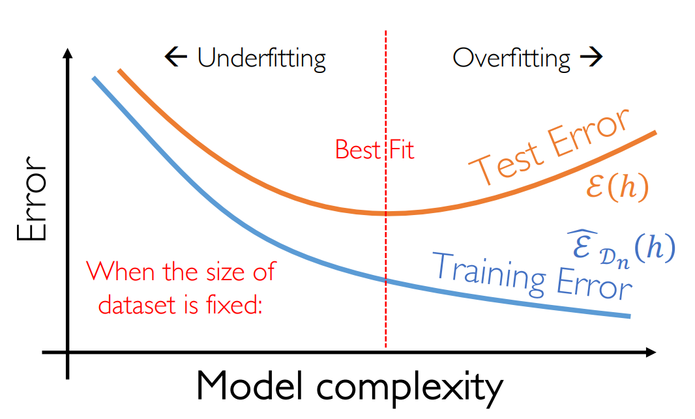

介绍学习理论，PAC。
<!--more-->
***This note is compiled based on the course materials provided by Professor Mingsheng Long in course "machine learning" at tsinghua university.*** 

# lecture 6

# Probably Approximately Correct

We know the components of learning, we need a hypothesis space , a learning algorithm……But  what can be learned efficiently, under what condition? And are there learning guarantees ?

## statistical view

From statistical machine learning view, there is a latent data generating distribution $D_{x\times y}$, all training and testing samples are generated from this distribution. So when  we learn a model on training set $D_{x\times y}$, this will not work for another distribution $D^{'}_{x\times y}$.

## generalization

What is the truth of learning ? Learning is not fitting!

- it should perform well on some unseen samples.
- the best for overall may not be the best on the sample
- generalization is not memorization
- complex rules(complex separation surfaces) are poor predictors

here lies a trade-off between performance on overall / the sample :

## expected error  vs. empirical error

When we do the training , we get **empirical error:**

 $h$ is the hypothesis , $D_n$ is the dataset

$$
\hat{\epsilon}_{D_n}(h)=\frac{1}{n}\sum_{i=1}^{n}l(h(x_i),y_i)
$$

The final goal of training is to get the **expected error:**

$$
\epsilon_{D_n}(h)=E_{(x,y)-D_{(x,y)}}l(h(x),y)
$$

But in fact , the distribution of dataset is unknown for us, impossible to get the expected error. We regard testing error as expected error **(an unbiased estimate)**. 

$$
\epsilon(h)=E_{D_n}\hat{\epsilon}_{D_n}(h)
$$

> h should  not be related to distribution d
> 

Here we define **Bayes Error:  under a certain hypothesis h produces the  minimum of expected error**

$$
\epsilon^*=min_{h,h\;measurable}\epsilon(h)
$$

## Bias-Variance Decomposition

**Bayes Optimal** of regression function: $E_{y}[y|x] = f^*(x)$

Then decompose the expected loss

$$
E_{D_n,y}[(h_{D_n}(x)-y)^2|x]=E_{D_n,y}[(h_{D_n}(x)-f^*(x)+f^*(x)-y)^2|x]
$$

$$
=E_{D_n,y}[(h_{D_n}(x)-f^*(x))^2+(f^*(x)-y)^2+2(h_{D_n}(x)-f^*(x))(f^*(x)-y)|x]
$$

The cross item is zero(from the definition of bayes optimal)

$$
=E_{D_n,y}[(h_{D_n}(x)-f^*(x))^2+(f^*(x)-y)^2|x]
$$

$$
=E_{D_n}[(h_{D_n}(x)-f^*(x))^2|x]+E_{y}[(f^*(x)-y)^2|x]
$$

需要注意，此处的第一项和数据采样分布相关，第二项和y取值相关。

The second item is **Bayes Error . Continue to decompose the first item.**

$$
E_{D_n}[(h_{D_n}(x)-f^*(x))^2|x]
$$

$$
=E_{D}[(h_{D}(x)-E_{D}[h_{D}(x)]+E_{D}[h_{D}(x)]-f^*(x))^2|x]
$$

The same, the cross item is zero.

$$
=E_{D}[(h_{D}(x)-E_{D}[h_{D}(x)])^2|x]+E_{D}[(E_{D}[h_{D}(x)]-f^*(x))^2|x]
$$

The first item is variance of h(x), the second item is the bias between hypothesis and bayes optimal.

In another word, the first is called **“estimation error”**, the second is called **“approximation error”**. 

Estimation error : how good is the learned certain hypothesis; a random variable as D is a random sample

Approximation error: how good is the hypothesis class

Theorem:

$$
\epsilon_{L2}(x) = var(y|x)+Bias[h_D(x)|x]^2+Var_{D}[h_D(x)|x]
$$

这里的第一项是贝叶斯损失，因为数据在收集统计时不可避免的会有噪声和误差；第二项是偏差（approximation error），衡量全体的假设空间对贝叶斯最优解逼近的差距；第三项是方差(estimation error)，衡量的是采样对于学到的假设的影响。

We focus on the estimation error $Var_{D_n}[h_D(x)|x]=E_{D_n,y}[(h_{D}(x)-E_{D}[h_{D}(x)])^2|x]$. 这是个变量，和采样相关；但是approximation error 和采样无关，只和根据先验选择出的假设空间相关。

Due to randomness of sampling, how to guarantee that

$$
|\hat{\epsilon}_{D_n}(h)-\epsilon(h)|\leq\epsilon
$$

small $\epsilon ,$ small $\delta$ is all we need.

Then naturally:

理解上来说，PAC可学习里面的不等式说的是estimation error“如果大”；外层说的是“这样的情况尽量少发生”。也就是在假设空间确定的情况下，起码需要保证，在从全分布中随机采样的情况下，学到的假设h很差的情况比较少。

这是自然的，但是并不完备。因为我们无论是在测试集还是在训练集上算得的损失均是经验损失（empirical error）而不是期望损失(expected error) 。