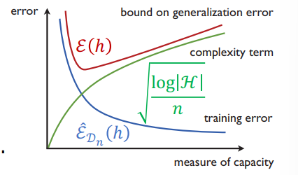

介绍有限空间上的泛化误差界。
<!--more-->
***This note is compiled based on the course materials provided by Professor Mingsheng Long in course "machine learning" at tsinghua university.*** 
***最近事多，拖到周末才写，无限空间的相关讨论明日补上。***

# lecture 7

# Generalization Bound for Finite Hypothesis Space

Case1 : we start with finite hypothesis space: $|H|<\infty$ 

What learning algorithm has a finite hypothesis space ?(by the way , teh learning algorithm should not be 指数复杂度)

## Generalization Bound by Hoeffding’s Inequality

Subscribe $X_i = l(h(x_i),y_i)$, X here is the loss.

$$
\sum_{i=1}^n(X_i-EX_i)=n(\hat{\epsilon}_{D_n}(h)-\epsilon(h))
$$

Assume bounded loss, say 01 loss: $l(h(x_i),y_i)\in [0,1]=[a_i,b_i]$

According to Hoeffding’s inequality: 

$P(|\sum_{i=1}^n(X_i-EX_i)\geq \epsilon|)\leq 2exp[-\frac{2\epsilon^2}{\sum_{i=1}^n(b_i-a_i)^2}]$

This evaluates the exprical and expected loss bias, which shows that the probability that there exists a certain(larger than some const) gap between experical and expected value is constrained by a upper bound, and the probability of falling into  a larger gap tends to be constrained.

Apply :

$$
P(n(\hat{\epsilon}_{D_n}(h)-\epsilon(h))\geq\epsilon)\leq 2e^{-\frac{2\epsilon^2}{n}}
$$

Replace $\epsilon$  with $n\epsilon$

$$
P((\hat{\epsilon}_{D_n}(h)-\epsilon(h))\geq\epsilon)\leq 2e^{-2n\epsilon^2}
$$

Inversion of probability, let $\delta = P(|\hat{\epsilon}_{D_n}(h)-\epsilon(h)|\geq \epsilon)$

$$
\epsilon \leq \sqrt{\frac{log\frac{2}{\delta}}{2n}}
$$

with Probability of $1-\delta$, $|\hat{\epsilon}_{D_n}(h)-\epsilon(h)|\leq \epsilon$. That is:

$$
|\hat{\epsilon}_{D_n}(h)-\epsilon(h)|\leq \epsilon\leq\sqrt{\frac{log\frac{2}{\delta}}{2n}}
$$

$$
\epsilon(h)\leq \hat{\epsilon }_{D_n}(h)+\sqrt{\frac{log\frac{2}{\delta}}{2n}}
$$

Till now, we find some relationship between experical and expected loss,  but there left one problem : we only conside the influence casued by different dataset sampling to the loss, but in reality , differ in dataset results in differ in $h$.

## Generalization Bound: Multiple Hypotheses

That says :

- $h_{D_n}=argmin\;\hat{\epsilon_{D_n}}(h)$ is sample-depentdent
- $\epsilon(h_{D_n}) = E_{D_n}\hat{\epsilon_{D_n}(h_{D_n})}$ does not hold any more

Safe idea: if we cannot get the exact h , we need to derive a uniform bound that holds with high probability for all hypothesis.

We should derive a bound of 

$$
P(\exists h \in H ,|\hat{\epsilon}_{D_n}(h)-\epsilon(h)|\geq \epsilon)=P(sup_{h\in H}|\hat{\epsilon}_{D_n}(h)-\epsilon(h)|\geq \epsilon)
$$

Recall the union bound of probability:

$$
P(\exists h\in H, |\hat{\epsilon}_{D_n}(h)-\epsilon(h)|\geq \epsilon)
$$

$$
=P(|\hat{\epsilon}_{D_n}(h_1)-\epsilon(h_1)|\geq \epsilon)\cup...\cup P(|\hat{\epsilon}_{D_n}(h_H)-\epsilon(h_H)|\geq \epsilon)
$$

$$
= \sum_{h\in H}P(|\hat{\epsilon}_{D_n}(h)-\epsilon(h)|\geq \epsilon)\leq2|H|exp(-2n\epsilon^2)
$$

Inversion of probability, let $\delta = P(|\hat{\epsilon}_{D_n}(h)-\epsilon(h)|\geq \epsilon)$. with probability at least $1-\delta$:

$$
\epsilon(h)\leq \hat{\epsilon }_{D_n}(h)+\sqrt{\frac{log|H|+log\frac{2}{\delta}}{2n}}
$$

？ 

- error bound in $O(\frac{1}{\sqrt{n}})$
- $log_2|H|$ is the number of bits to encode H
- Occam’s Razor: plurality should not be posited without necessity; so please choose the parsimonious explanation ( smallest |H| )

*Discretization Trick:*

*If our hypothesis space is parameterized by d numbers, in practice
we learn a hypothesis space of size at most $2^{64d}$, replace $log|H|$  with $2^{64d}$*

# Genaralization Bound for infinite Hypothesis Space

## Gademacher Complexity

Consider the 01-loss on a binary dataset 

- empirical error: $\frac{1}{n}\sum_{i=1}^n1[h(x_i)\neq y_i]=\frac{1}{2}-\frac{1}{2n}\sum_{i=1}^ny_ih(x_i)$
- perfect fit: $\frac{1}{n}\sum_{i=1}^ny_ih(x_i)=1$

For hypithesis space H ,$\exists h\in H$ well fits the dataset 

$$
sup_{h\in H}\frac{1}{n}\sum_{i=1}^ny_ih(x_i)=1
$$

So how to measure the ability of H to shatter dataset? We can measure the average loss on all dichotomies ( $2^n$  in total ). 

$$
\frac{1}{2^n}\sum_{y}sup_{h\in H}\frac{1}{n}\sum_{i=1}^ny_ih(x_i)=E_y  \;sup_{h\in H}\frac{1}{n}\sum_{i=1}^ny_ih(x_i)
$$

### Rademacher Complexity

to be continue……