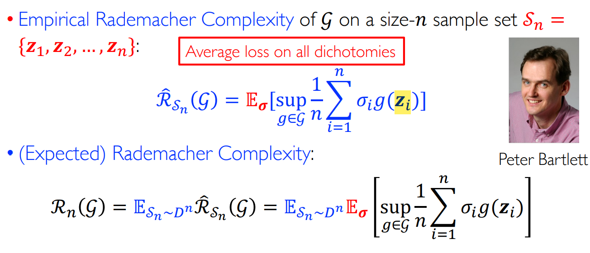

介绍无限空间上的泛化误差界。
<!--more-->
***This note is compiled based on the course materials provided by Professor Mingsheng Long in course "machine learning" at tsinghua university.*** 
***有关Growth function和VC维的内容不全，后续会补上。***
# lecture 8

# Generalization Bound for infinite Hypothesis Space

If the hypothesis is infinite, what if the upper bound of expected loss? For hypothesis not being countable, the number of linear classification is infinite. Contradiction! We need to find other ways to measure the ability of fitting data.

And we only consider **binary classification** - generalizable to multiclass

**Basic idea:**

To measure the loss of a classifier on all possibilities of binary classifications on a set of n data points, each possibility is called a dichotomy (对分) ($2^n$  for n dots). More powerful hypothesis space fits more dichotomies.

We call a hypothesis space ℋ shatters (打散) a dataset of n points, if the hypotheses in ℋ can fit all dichotomies on this dataset.

## Rademacher Complexity

Consider the 01-loss on a binary dataset (-1/1)

- empirical error: $\frac{1}{n}\sum_{i=1}^n1[h(x_i)\neq y_i]=\frac{1}{2}-\frac{1}{2n}\sum_{i=1}^ny_ih(x_i)$
- perfect fit: $\frac{1}{n}\sum_{i=1}^ny_ih(x_i)=1$

For hypothesis space H ,$\exists h\in H$ well fits the dataset 

$$
sup_{h\in H}\frac{1}{n}\sum_{i=1}^ny_ih(x_i)=1
$$

So how to measure the ability of H to shatter dataset? We can measure the average loss on all dichotomies ( $2^n$  in total ). 

$$
\frac{1}{2^n}\sum_{y}sup_{h\in H}\frac{1}{n}\sum_{i=1}^ny_ih(x_i)=E_y  \;sup_{h\in H}\frac{1}{n}\sum_{i=1}^ny_ih(x_i)
$$

### Rademacher Complexity

$\sigma$ is the label, $g$ is the function in this hypothesis space, $S_n$ is the distribution of sample data.

### Theorem: decreasing complexity as n increases

$$
R_{n+1}(S)\leq R_n(S)
$$

### Rademacher Complexity Bound

$$
sup_{h\in H}\frac{1}{n}\sum_{i=1}^n\sigma_i h(x_i)<1\rightarrow \hat{R}_{S_n(H)<1}
$$

Rademacher Complexity of a hypothesis space ℋ can measure the shattering ability of ℋ.

We consider $G$ instead of $H$. $G$  is a derived function space, which is derived from hypothesis space and related with loss function: 

$$
G=\{g:(x,y)\rightarrow l(h(x),y)|h\in H\}
$$

Rademacher Complexity Bound: 

(Here lies a hypothesis: all z is i.i.d for distribution D)

Proof:

Apply McDiarmid’s inequality

(Uniform Bound) 

$$
\Phi(S)=sup_{g\in G} (E_D[g]-\hat{E}_S[g]), S=(z_1,z_2,...,z_n)
$$

Suppose $S^{'},S$ differ at $z_i$, check condition $|\Phi (S)-\Phi(S^{'})|\leq c_i$ 

$$
|\Phi (S)-\Phi(S^{'})|\leq sup_{g\in G} (E_D[g]-\hat{E}_S[g])-sup_{g\in G} (E_D[g]-\hat{E}_{S^{'}}[g])
$$

$$
\leq sup_{g\in G}\{(E_D[g]-\hat{E}_S[g])- (E_D[g]-\hat{E}_{S^{'}}[g])\}
$$

$$
= sup_{g\in G} (\hat{E}_{S^{'}}[g]-\hat{E}_{S}[g])=sup_{g\in G}\{\frac{1}{n}\sum_{z\in S^{'}}g(z)-\frac{1}{n}\sum_{z\in S}g(z)\}=\frac{1}{n}sup_{g\in G} (g(z^{'}_i)-g(z_i))
$$

**We get:**

$$
|\Phi (S)-\Phi(S^{'})|\leq \frac{1}{n}
$$

Recall McDiarmid’s inequality:

$$
P(|f(Z_1,...,Z_n)-Ef(Z_1,...,Z_n)|\geq \epsilon)\leq 2exp[-\frac{2\epsilon^2}{\sum_{i=1}^n(c_i)^2}]
$$

One side bound:

$$
P(\Phi(S)-E_S\Phi(S)\geq \epsilon)\leq exp[-\frac{2\epsilon^2}{\sum_{i=1}^n(c_i)^2}]
$$

So with possibility $1-\frac{\delta}{2}$,

$$
\Phi(S)\leq E_S[\Phi(S)]+\sqrt{\frac{log(2/\delta)}{2n}}
$$

For $E_S[\Phi(S)]$:

$$
E_S[\Phi(S)]= E_S[sup_{g\in G}(E_{D}[g]-\hat{E}_S[g])]
$$

$$
=E_S[sup_{g\in G}(E_{S^{'}-D}\hat{E}_{S^{'}}[g]-\hat{E}_S[g])]
$$

$$
\leq E_{S,S^{'}}[sup_{g\in G}(\hat{E}_{S^{'}}[g]-\hat{E}_S[g])]
$$

$$
= E_{S,S^{'}}[sup_{g\in G}\frac{1}{n}\sum_{i=1}^{n}(g(z_i^{'})-g(z_i))]
$$

$$
= E_{S,S^{'},\sigma}[sup_{g\in G}\frac{1}{n}\sum_{i=1}^{n}\sigma_i( g(z_i^{'})-g(z_i))]
$$

$$
\leq E_{S,\sigma}[sup_{g\in G}\frac{1}{n}\sum_{i=1}^{n}\sigma_ig(z_i^{'})]+E_{S^{'},\sigma}[sup_{g\in G}-\frac{1}{n}\sum_{i=1}^{n}\sigma_ig(z_i)]
$$

$$
= 2E_{S,\sigma}[sup_{g\in G}\frac{1}{n}\sum_{i=1}^{n}\sigma_ig(z_i)]=2R_n(G)
$$

Here, we have two bounds:

1. with possibility $1-\frac{\delta}{2}$,

$$
\Phi(S)\leq E_S[\Phi(S)]+\sqrt{\frac{log(2/\delta)}{2n}}
$$

1. $E_S[\Phi(S)]\leq 2R_n(G)$

For 1 , replace $\frac{\delta}{2}$ with $\delta$.

Combining 1 and 2, we can get, with possibility $1-\delta$,

$$
\Phi(S)\leq 2R_n(G)+\sqrt{\frac{log(1/\delta)}{2n}}
$$

Then we will bounding $R_N(G)$.

$$
\hat{R}_n(G)=E_{\sigma}  \;sup_{g\in G}\frac{1}{n}\sum_{i=1}^n\sigma_ig(z_i)
$$

Change $S$ to $S^{'}=\{z_1,...,z_i^{'},...,z_n\}$ that differs only at $z_{i}^{'}\neq z_i$

$$
\hat{R}_{S^{'}}(G)-\hat{R}_{S}(G)\leq |\frac{1}{n}E_{\sigma}[sup_{g\in G}\{\sigma_ig(z_i)-\sigma_ig(z_i^{'})\}]|\leq \frac{1}{n}
$$

That is say: with possibility $1-\frac{\delta}{2}$

$$
R_{n}(G)\leq \hat{R}_{n}(G)+\sqrt{\frac{log(2/\sigma)}{2n}}
$$

1. the third equation: with possibility $1-\frac{\delta}{2}$ at least 
    
    $$
    R_{n}(G)\leq \hat{R}_{n}(G)+\sqrt{\frac{log(2/\sigma)}{2n}}
    $$
    

Then use the union bound:

Event A: 

$$
E_D[g]\leq \hat{E}_{D_n}[g]+2R_n(G)+\sqrt{\frac{log(2/\delta)}{2n}}
$$

Event B:

$$
R_{n}(G)\leq \hat{R}_{n}(G)+\sqrt{\frac{log(2/\sigma)}{2n}}
$$

since $P(!A)\leq \frac{\delta}{2},\;P(!B)\leq \frac{\delta}{2}$

$$
P(AB)=1-P(!AB)\geq 1-P(!A)-P(!B)\geq 1-\delta
$$

### Function Space G for 01-loss

### Rademacher Complexity Bound

## Growth Function

$\Pi_{H}:N\rightarrow N$ for a hypothesis set H is defined by :

$$
\forall \textbf{n} \in \textbf{N}, \Pi_{H}(n)=\textbf{max}_{x_1,...,x_n}|\{h(x_1),...,h(x_n):h\in H\}|
$$

对于分布X中采样得到的某n个样本，假设空间可以fit的结果种类最大值

The maximum number of ways n points can be classified using ℋ.

 $\Pi_{H}(n)\leq 2^n$, if  $\Pi_{H}(n)= 2^n$, H shatters dataset  $\{x_1,…,x_n\}$.

### Massart’s lemma

$A\subset R^n$ be  a finite set with $R=max_{x\in A}||x||_2$

$$
E_{\sigma}[\frac{1}{n}sup_{x\in A} \sum_{i=1}^n\sigma_ix_i]\leq \frac{R\sqrt{2log|A|}}{n}
$$

### Growth Function & Rademacher Complexity

$$
R_{n}(G)\leq \sqrt{\frac{2log\Pi_G(n)}{n}}
$$

So replace rademacher complexity with growth function bound

## Vapnik-Chervonenkis Dimension (VC-dim)

VC-dimension of a hypothesis space H is defined by 

$$
VCdim(H)=max\{n:\Pi_{H}(n)=2^n\}
$$

VC-dimension is the size of the largest set that can be shattered by H.

- sample size n can be shattered
- sample size n+1 can not be shattered

In general, VCdim hyperplane in $R^d=d+1$ 

### Sauer’s lemma

find the proof in slides ☹️

### VC-Dimension Bound

# conclusion

