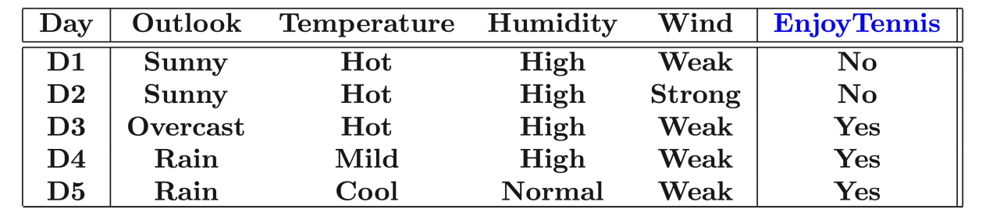

介绍决策树算法。
<!--more-->
***This note is compiled based on the course materials provided by Professor Mingsheng Long in course "machine learning" at tsinghua university.*** 
***周一发烧了，这周末补上。***
# lecture 9

# decision tree

## overview

For the data is shown in table as shown below , how we represent the feature?

1. transform word into vector
    1. embedding, work in deep learning
    2. convert “sunny” into 1, “overcast” into  2,…… : not work! 1,2,3,4 is ordered, but the feature here is not ordered. → use one hot encoding!
    
    after converting into vector, the interpretability decreased.
    

For human , how we solve the problem?

we choose one important label for classification, then use the second most important feature for further classification. This is desicion tree. 

This model will generalize to unseen data, which capture the shared features.

three questions:

1. How to find the most useful feature on each node?
2. when should we stop growing the tree?
3. what if some feature are missing or continuous-valued?

(internal node and leaf node are a subset of dataset, the leaf node represents a classification)

## ID 3 Algorithm

### node splitting

After one node is split by different features, we will get different split results, which kind of split if better?

 

We want pure leaf nodes, as close to a single class as possible. This lead to a lower classification error. We’ll choose the splitting feature that minimizes impurity measure. So how we measure node impurity?

**misclassification error:**

$$
Err(\mathcal{D})=1-max_{1\leq k\leq K} \frac{|C_k|}{|\mathcal{D}|}
$$

**entropy (used in ID3 and C4.5) :**

$$
H(\mathcal{D})=-\sum_{k=1}^K\frac{|C_k|}{|D|}log\frac{|C_k|}{|D|}
$$

**Gini index (used in CART):**  

$$
Gini(\mathcal{D})=1-sum_{k=1}^{K}(\frac{|C_k|}{|D|})^2
$$

**Larger number means less purity.**

### information gain (IG)

We use entropy as an example to measure a split. The dataset is $\mathcal{D}=\mathcal{D_1}\cup\mathcal{D_2}$. A natural way is decrementing the sum of child entropy from parent entropy. But the instance number of  each node is different, so we add weight for each node’s entropy.

$$
H(\mathcal{D_1}\cup\mathcal{D_2})-\frac{|\mathcal{D_1}|}{|\mathcal{D}|}H(\mathcal{D_1})-\frac{|\mathcal{D_2}|}{|\mathcal{D}|}H(\mathcal{D_2})
$$

> In information theory, entropy is the expected number of bits needed to encode a randomly drawn value of X.
Larger entropy, less information. That’s why we call it IG.
> 

We compute IG for all splits induced by every feature. 

- if IGs of all features are small, stop.
- else: find the feature that maximizes the information gain.

### ID 3 algorithm

## C4.5 Algorithm

C 4.5 is generally similar to ID 3 algorithm, just with some patches added.

### IG Rate

Consider use primary key for classification, we will get max information gain but this model is useless for classification. The problem hidden is that information gain tends to prefer **those multivalued features** and cover up features with fewer numbers of values.

By penalizing multivalued rate, IG is improved to Gain Ratio (GR):

$$
GR = \frac{\textbf{informtation Gain}}{\textbf{multivalued rate}}=\frac{IG}{IV}
$$

multivalued rate is :

$$
\textbf{IV}(F)=-\sum_{i=1}^{|V|}\frac{|D_i|}{|D|}log(\frac{|D_i|}{|D|})
$$

- this is the entropy of the value probability of feature f

### Attribute with costs

The importance of each feature differs. We need to avoid non-necessary cost and pay more attention to the feature that matter. 

$$
\frac{\textbf{Gain Ratio}^2}{\textbf{Cost}}
$$

The cost is defined by hand ( feature engineering )

### Missing values

There are some missing values in the dataset. 

- delete features or samples with the missing value? but this will lose useful information, not a good way 😐

in C4.5:

- training phase: reweight samples with missing values
- testing phasing: supplement missing values with the most common one

Step 1:

- compute the ratio of samples with missing value: $|\hat{D}|/|D|=\rho$
- compute the IG on $|\hat{H}|/|H|$ ( all samples with value )
- the IG for this feature for all samples is $(1-\rho) \cdot \textbf{IG}$

Step 2: how to assign the samples that miss value on this feature?

- assign them to all nodes but with weights proportional to node sizes
- each sample is weighted as 1 as the root node
- computing weighted information gain on the child node

### Continuous variables

- add threshold to split
- how to choose the threshold ? check performance of n-1 splits and find the one with the highest IG

### Pruning

Decision tree has the ability to fit all data except noisy samples with same features and different labels.

Overfitting also appears in decision tree.

**Pre-Pruning** 

Tree complexity is measured by numbers of layers and branches. By controlling number of layers, we can prevent overfitting.

- During training for every split, use the change of accuracy on validation set to measure the necessity of this split
- may cause underfitting: a good split may not change the classification error !😵

P**ost-Pruning**

first construct a complete tree, then from leaf node to root node, use the change of accuracy on validation set to measure the necessity of pruning on this node.

**Tree complexity regularization**

$$
C_{\alpha}(T)=\hat{\epsilon}(T)+\alpha (T)=\sum_{t=1}^{|T|}N_tH_{t}(T)+\alpha |T|=-\sum_{t=1}^{|T|}\sum_{k=1}^{K}N_{tk}log\frac{N_tk}{N_t}+\alpha |T|
$$

- $|T|$ is leaf nodes , $N_{tk}$ is the examples of class k of leaf node t
- $\hat{\epsilon}(T)$ is the empirical error of the tree on the training data

cost complexity pruning 

- compute the empirical entropy $H_t(T)$ of each node
- recursively shrink from leaf nodes to internal nodes( if $C_{\alpha }(T_B)\leq C_{\alpha }(T_a)$, prune leaf A and use parent B as the new leaf )

## Understanding decision tree

- decision tree divide the feature space into axis-parallel rectangles !
- each rectangle region is labeled with a specific label
- curse of dimensionality!
- each split can be viewed as a linear classification

Multivariate decision tree: good expressivity but weak interpretability. But we wonder are Expressivity and interpretability in conflict?

In fact the interpretability does not increase here, decision tree can fit almost all dataset.

# CART

## classification tree: Gini Index

we can use Gini index to evaluate node split in CART, which is  a binary tree 

## regression tree

